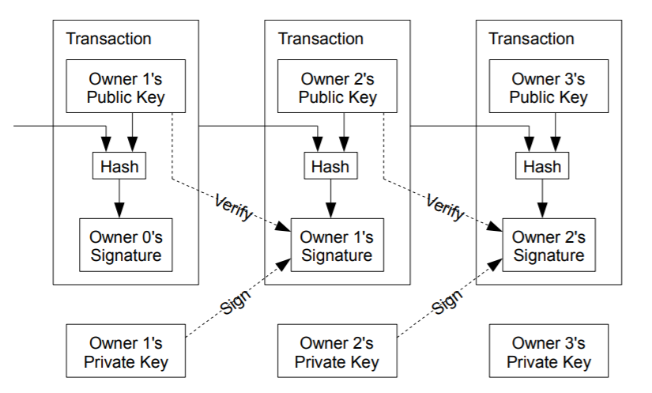

# Notes for Blockchain

## References Recommended by Debajyoti Ray
* [Bitcoin: A Peer-to-Peer Electronic Cash System](https://bitcoin.org/bitcoin.pdf) by Satoshi Nakamoto (2008) - The paper that started it all
  > * A purely peer-to-peer version of electronic cash without a trusted third party required
  > * The network timestamps transactions by hashing them into an ongoing chain of hash-based proof-of-work
  > * The trust based model - mediation cost (no small transactions), needs more information from customers, unavoidable fraud
  > * The cryptographic proof based model - secure as long as collective honest nodes control more CPU power than attacker nodes
  
* [On Bitcoin and Red Balloons](https://www.microsoft.com/en-us/research/publication/on-bitcoin-and-red-balloons/) by Moshe Babaioff et al. at Microsoft Research - An interesting analysis
* [The Tangle](https://iota.org/IOTA_Whitepaper.pdf) by Serguei Popov - The IOTA whitepaper
* [Ethereum: A Secure Decentralised Generalised Transaction Ledger](http://gavwood.com/paper.pdf) by Gavin Wood - The Ethereum paper
* [Data Science to Evaluate ICOs](https://medium.com/towards-data-science/data-science-to-evaluate-icos-f5d59948f05a) by Debajyoti Ray
